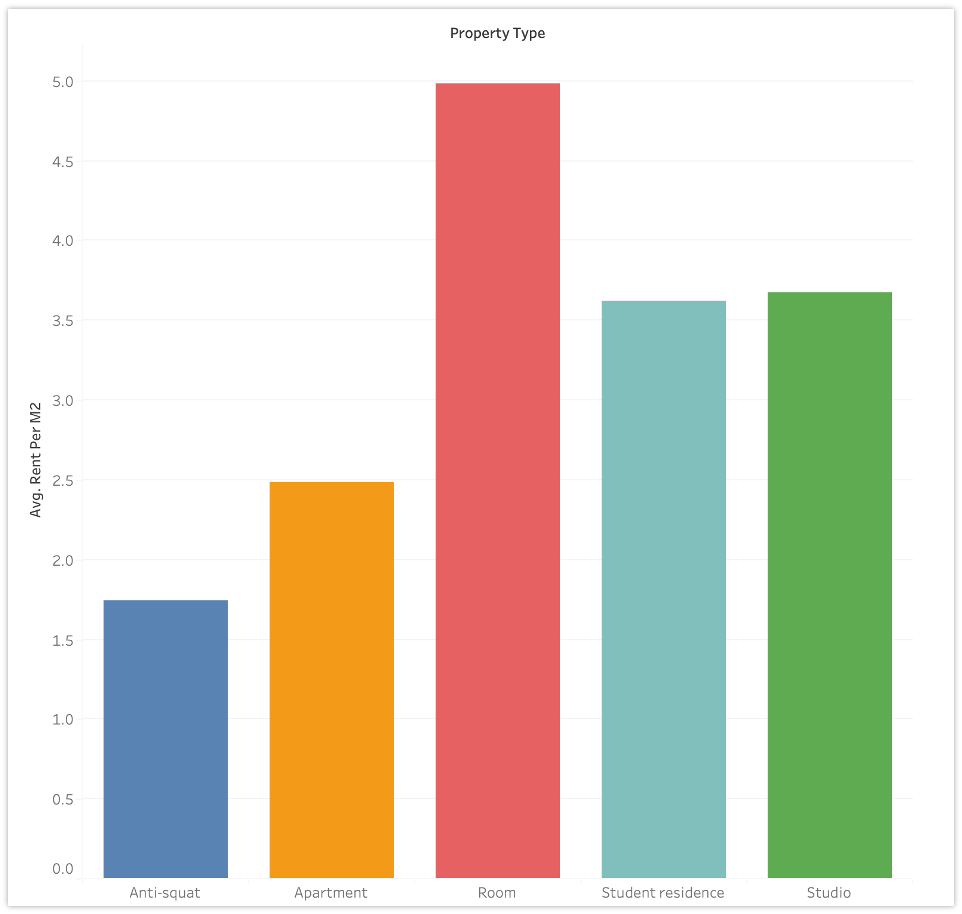

# mid_project
# Rental price analysis in Amsterdam

AyeeshaSiddikka

### Index:

* [Purpose of the study](#section1)
* [Materials and Methods](#section2)
* [Tableau](#section3)
* [SQL](#section4)
* [Linear Regression Model](#section5)
* [Conclusion](#section6)
* [Files](#section7)

### Purpose of the study

In this project, I am working as data analyst for a Housing rental Company. My company created machine learning models to predict the rental prices in Amsterdam. 
The main objectives of this study include 1) Does the houses closer to the city centre have any impact on rent?, 2) hypothesis testing to decide whether the data sufficiently support the hypothesis, and 3) building linear regression models to predict the average rent.

### Materials and Methods

The dataset is taken from www.kaggle.com website. Source of the dataset includes 1) all the rental properties in Netherlands(2019-2020) and 2)for my analysis I took only the data for the city of Amsterdam.

Rental parameters in the dataset are area,deposit,distance,rent_per_m2,furnish,property_type,energy_label,kitchen,shower,toilet.  The dataset consists of rental parameters of Amsterdam. The 80% rental data is used to train the linear regression model and 20%  of the data is used to test the linear regresion model. The studies are performed on .csv and excel files using Python, Mysql, and Tableau softwares.

NaN values in the dataset are replaced by mean value of the columns. Then, outliers are removed. After that, the rental dataset is exported as csv and excel files. These files are then imported in to Tableau and Mysql.

The methods of this study include the followings:
* Get data
* Exploratory data analyses
* Data cleaning
* Data visualization
* Check for multicollinearity
* Hypothesis testing
* Data wrangling
* Build model

### Tableau
[Link to Tableau](https://public.tableau.com/app/profile/ayeeshasiddikka/viz/Amsterdam_project_updated/Storyaboutmyproject)

* The csv and excel files are imported into Tableau. The rental parameters are plotted to visualize and observe their relations as seen in plot below.

### SQL

The rent schema is created in SQL. Then,the rent data is imported into Python via queries.

### Linear Regression Model

The cleaned data is checked for multicollinearity before building linear regression model. 
The area of the house and rent are highly corelated with a value of 0.83, which implies that the bigger the house the more the rent
Rent and deposit are having a positive corelation of 0.37, which implies that there is less corelation between rent and deposit. I highly suspect that this less corelation is because there were lot of missing values for deposits in the dataset which were filled with 0
Rent and distance are having a negative corelation of -0.26, which implies that, if the distance is longer then the rent is lesser
Another important observation  is that, there exists a negative corelation of 0.16 between area and distance, which implies that the houses closer to city center are bigger!. The rent_per_m2 and area is negatively correlated(-0.65), which implies that the bigger area houses are having relatively less rent. so the demand for bigger houses are less rent when compared to smaller houses.
 The R2 score is 0.8168. 

### Conclusion

Based on the analysis, there is a clear evidence that, the rental prices are quite high in Amsterdam, irrespective of the other factors like, size, distance and energy label, etc.,
This could be due to the supply and demand factors

### Files
CSV_files: exported from Python and imported to Mysql and Tableau

Excel_files: exported from Python and imported to Tableau

Model_results: exported from Python and imported to Tableau

Presentation: pdf file of the presentation

Python: project dataset and Jupiter notebook file (mid_project)

SQL: mysql files of the project. 